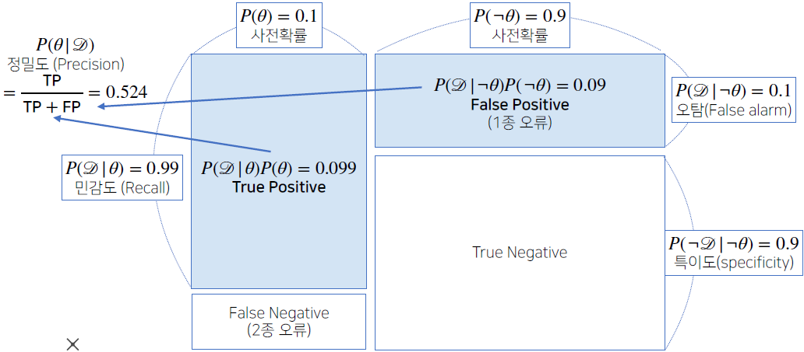
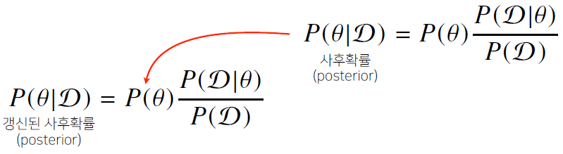
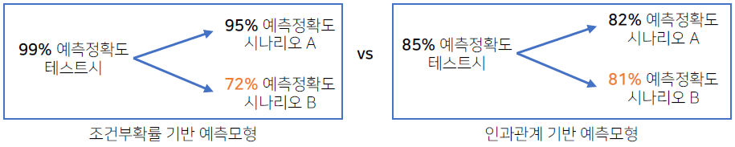
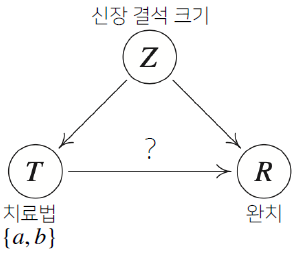
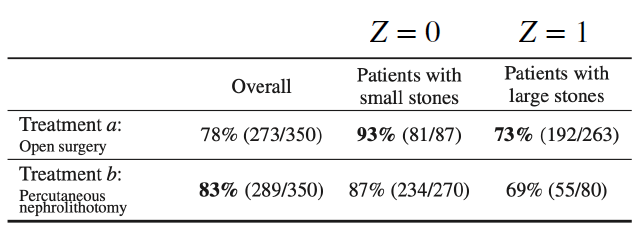

# [AI Math 8강] 베이즈 통계학

조건부확률에서 이어지는 개념인 **베이즈 정리**와 **인과관계 추론**에 대해 설명합니다. 베이즈 정리는 **데이터가 새로 추가되었을 때 정보를 업데이트하는 방식**에 대한 기반이 되므로 오늘날 머신러닝에 사용되는 예측모형의 방법론으로 굉장히 많이 사용되는 개념입니다. 이 때 나오는 **사전확률, 사후확률, evidence** 등의 개념은 강의에서 나오는 예제를 활용해서 정확히 이해하시기 바랍니다.

인과관계 추론의 경우, 조건부확률을 섣불리 사용해선 안되는 이유와 중첩효과를 제거함으로써 얻은 인과관계를 어떤 방식으로 활용할 수 있는지에 초점을 두고 공부하시면 좋겠습니다.

 

# 1. 조건부 확률

- 베이즈 통계학을 이해하기 위해선 조건부 확률의 개념을 이해해야 한다. 
	$$
	P(A\cap B) = P(B)P(A\vert B)
	$$

- 베이즈 정리 : 조건부 확률을 이용하여 정보를 갱신하는 방법
	$$
	P(B\vert A) = \frac{P(A\cap B)}{P(A)} = P(B)\frac{P(A\vert B)}{P(A)}
	$$
	

## 1.1. 베이즈정리 : 예제

$$
P(\theta\vert \mathcal{D}) = P(\theta)\frac{P(\mathcal{D}\vert \theta)}{P(\mathcal{D})}
$$

여기서 각 `term`의 의미는 다음과 같다. 

> $P(\theta\vert \mathcal{D})$ : 사후확률(posterior) - 데이터가 관찰이 되었을 때 파라미터 $\theta$가 관찰될 확률
>
> $P(\mathcal{D}\vert \theta)$ : 가능도(likelihood) 
>
> $P(\theta)$ : 사전확률(prior) - 데이터가 주어지지 않은 상황에서의 $\theta$가 일어날 확률
>
> $P(\mathcal{D})$ : Evidence - 데이터 전체의 분포

( **Q** ) Covid-99의 발병률의 10%로 알려져있다. Covid-99에 실제로 걸렸을 때 검진될 확률은 99%, 실제로 걸리지 않았을 때 오검진될 확률이 1%라고 할 때, 어떤 사람이 질병에 걸렸다고 검진결과가 나왔을 때 정말로 Covid-99에 감염되었을 확률은? 

> 여기서 $\theta$는 실제로 걸린 경우를 뜻한다.
>
> $\mathcal{D}$는 검진되는 경우를 의미한다. 

- 알려진 10%의 발병확률을 사전확률 $P(\theta)$라고 말할 수 있으므로 $P(\theta) = 0.1$이다.

- 실제로 걸렸을 때, 검진될 확률은 $P(\mathcal{D}\vert\theta)=0.99$ 으로 표현할 수 있고

- 실제로 걸리지 않았는데 오검진될 확률은 $P(\mathcal{D}\vert\neg\theta)=0.01$으로 나타낼 수 있다. 

- 중심극한정리에 의해 $P(\mathcal{D})=\sum_{\theta}P(\mathcal{D}\vert\theta)P(\theta)$로 표현할 수 있다.

- 따라서 $P(\mathcal{D})=0.99\times0.1+0.01\times0.9=0.108$이고

- 결과적으로 
	$$
	P(\theta\vert \mathcal{D}) = P(\theta)\frac{P(\mathcal{D}\vert \theta)}{P(\mathcal{D})}\approx 0.916
	$$
	으로 계산된다. 

 

## 1.2. 조건부 확률의 시각화

앞 절의 예제를 시각화한다면 다음과 같이 표현할 수 있다.

정밀도는(Precision) 그림에서 True Positive와 False Positive(`1종 오류`)의 합에서 TP의 비율을 의미한다. 이 때 만일 1종오류의 비율이 커지면 정밀도는 절반가량으로 줄어든다. 

# 2. 베이즈 정리를 통한 정보의 갱신

- 앞서 베이즈 정리를 통해 사전확률과 사후확률의 관계를 알아보았다. 
	$$
	P(\theta\vert \mathcal{D}) = P(\theta)\frac{P(\mathcal{D}\vert \theta)}{P(\mathcal{D})}
	$$

- 사전확률로부터 계산된 사후확률이 다시 다음 사전확률로 사용될 경우 다음과 같이 `갱신된 사후확률`을 계산할 수 있다.

	

	- ex) 앞선 문제에서 covid-99 판정을 받은 사람이 두 번째 검진을 받았을 때도 양성이 나왔다면, 이 사람이 진짜 covid-99에 걸렸을 확률은?

- $P(\mathcal{D}\vert\neg\theta)=0.1$이고, $P(\mathcal{D}\vert\theta)=0.99$라면, $P(\theta\vert \mathcal{D})\approx 0.524$로 계산된다. 

- 그렇다면 갱신된 Evidence $P(\mathcal{D^*})=0.99\times 0.524 + 0.1\times 0.476\approx 0.566$이 된다. 

- 따라서 이를 다시 베이즈 정리에 적용하면
	$$
	P(\theta\vert \mathcal{D}^*)=0.524\times \frac{0.99}{0.566}\approx0.917
	$$
	이 됨을 알 수 있다. 

	> 세번째 검사까지 양성으로 나온다면 정밀도는 99.1%로 갱신된다.

 

## 2.1. 조건부확률과 인과관계

- 이처럼 베이지안 정리는 갱신을 통한 다음 사후확률을 계산할 수 있지만, 이를 인과관계 추론에 이용해서는 안된다. 

- 또한, 인과관계 역시 데이터 분포의 변화에 Robust한 모델을 만들때 필요하지만 높은 정확도를 담보하긴 힘들다.

	

	

 

## 2.2. 인과관계 추론 : 예제

- 신장 결석의 크기에 따라 다음과 같이 치료법 a와 b를 사용한다고 가정하자

	

- 이에 따른 완치율을 계산했을 때 그 확률을 계산하면 아래와 같을 때,

	

- **Q)** 왜 신장결석의 크기($\mathbf{Z}$) 두 집단 모두 치료법 $\mathbf{a}$가 더 좋은 완치율을 보이는데, 전체 환자를 대상으로 한 완치율은 $\mathbf{b}$가 더 높다고 계산될까

	> 이러한 오류를 **`심슨의 패러독스`**라고 한다.

- 신장결석의 크기는 치료법과 완치 모두에 영향을 주는 요소이기 때문에, 이를 베이지안 정리로 함부로 계산하면 안된다. 

- do($T=a$)라는 조정효과를 통해 $Z$의 개입을 제거한다.
	$$
	\begin{align}
	P^{\mathfrak{C}_a}(R=1)
	&=\sum_{z\in\left\{0,1\right\}}P^{\mathfrak{C}}(R=1\vert T=a, Z=z)P^{\mathfrak{C}}(Z=z)\\
	&=\frac{81}{87}\times\frac{(87+270)}{700}+\frac{192}{263}\times\frac{(263+80)}{700}\approx 0.8325
	\end{align}
	$$

- do($T=b$)라는 조정효과를 통해 $Z$의 개입을 제거한다.
	$$
	\begin{align}
	P^{\mathfrak{C}_b}(R=1)
	&=\sum_{z\in\left\{0,1\right\}}P^{\mathfrak{C}}(R=1\vert T=b, Z=z)P^{\mathfrak{C}}(Z=z)\\
	&=\frac{234}{270}\times\frac{(87+270)}{700}+\frac{55}{80}\times\frac{(263+80)}{700}\approx 0.7789
	\end{align}
	$$
	

- **조건부확률로 계산한 치료효과와 정반대의 결과가 나오게 된다.**

