# [DLBasic] Historical Review

# 1. Introduction

- 좋은 딥러닝 엔지니어?
	1. Implementation skills (Tensorflow, Pytorch)
	2. Math Skills (Linear Algebra, Probability theory)
	3. Knowing ~~a lot of recent~~ Papers :강의에서는 꼭 알아야하는 것들을 위주로 
- 인공지능의 정의?
	- 사람의 지능을 모방하는 행위
	- 비단 딥러닝만을 의미하지는 않음(머신러닝)
- Key components
	- The **data** that the model can learn from : 데이터가 중요함 결국
	- 데이터를 학습할 **모델**
	- 모델을 학습시키기 위한 **손실함수**
	- 손실함수를 최소화하기 위한 **알고리즘**
	- 왜 이 4가지가 중요?
		- 새로운 논문을 볼때 이를 중점으로 보면 이해하기 쉽다. 

## 1.1. Data

- 데이터는 우리가 풀고자하는 문제에 **depend** 하게 되어있다.
- 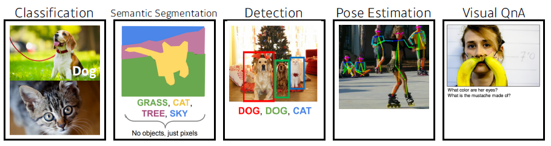

 

## 1.2. Model

- 같은 데이터여도 모델에 따라 그 결과는 천차만별이다.

	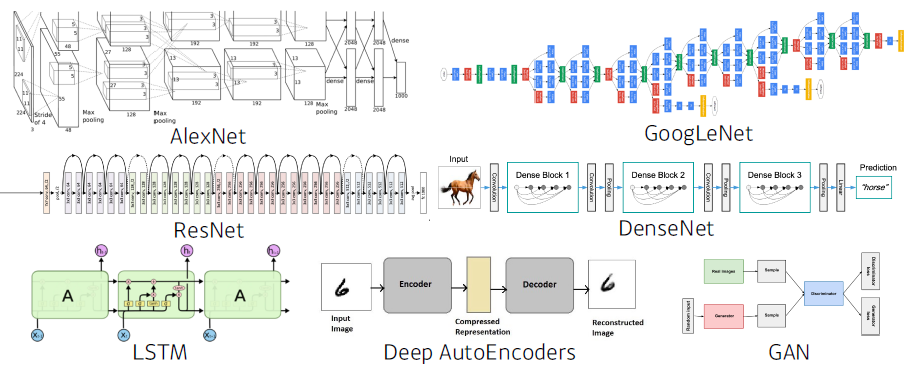

 

## 1.3. Loss

- The **loss** function is a proxy of what we want to achieve / 원하는 태스크에 맞는 손실함수의 정의가 필요하다.

	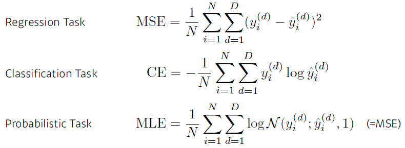

 

## 1.4. Optimization Algorithm

- 손실함수가 잘 학습할 수 있도록 다양한 optimization 방식을 사용한다. 
- 목적은 학습하지 않은 데이터에서도 Robust한 모델을 만드는 것이므로, 오히려 학습에 방해가 되게끔 유도하는 방식을 추가한다. 
	- Dropout
	-  Early stopping
	- k-fold validation
	- weight decay
	- batch normalization
	- mixup
	- ensemble
	- Bayesian optimization

 

# 2. Historical Review

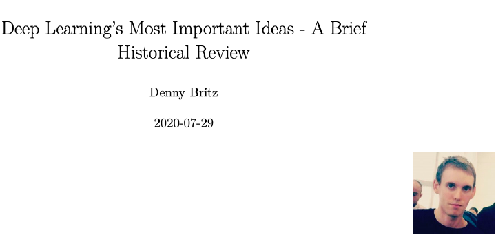

> Denny Britz의 위 논문에는 딥러닝 역사에 영향을 준 아이디어들을 소개하고 있다.

논문(?)은 [**`여기`**](https://dennybritz.com/blog/deep-learning-most-important-ideas/)에서 확인할 수 있다.

 

## 2.1. AlexNet

- 이미지넷에서 1등을 한 모델

- 처음으로 딥러닝 알고리즘이 1위를 한 모델이며, 이후 패러다임 쉬프팅이 일어났다고 봐도 무방할 정도로 딥러닝의 우세가 이어졌다.

	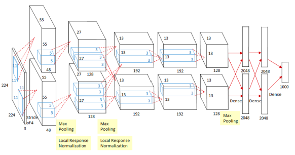

	

 

## 2.2. DQN

- 딥마인드가 아타리라고 불리는 게임에 접목한 모델

- 지금의 구글 딥마인드가 있게 된 모델

	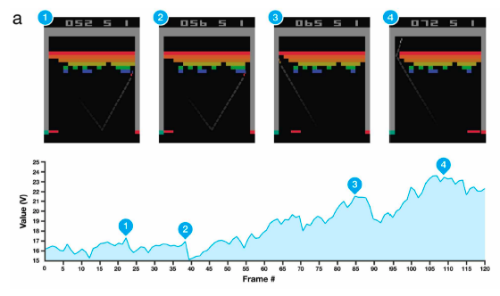

 

## 2.3. Encoder / Decoder

- 이후 NMT 분야의 많은 발전이 이어졌다. 

	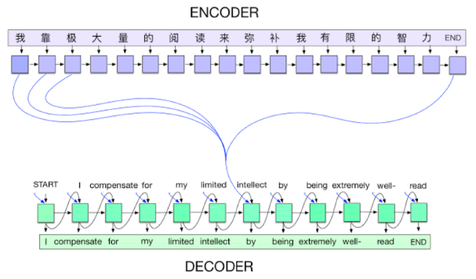

 

## 2.4. Adam Optimizer

- 옵티마이저에는 다양한 방식이 있다. 

- 보통 논문에 learning rate scheduler에 대한 내용은 언급되어 있지 않다. (이유가 없다. )

	- 이유? 그렇게 하지 않으면 구현이 되지 않는다. 

- 다양한 hyperparameter를 시도하는데, 리소스 자원에 따른 제한이 있게 된다. 

- 그러한 차원에서 `웬만해서 잘되는` Adam optimizer는 중요한 의미를 지닌다. 

	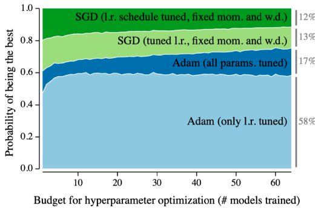

 

## 2.5. GAN

- 이미지를 만들고, 텍스트를 만드는 생성모델

- 서로 경쟁하는 두 개의 모델을 학습시킨다는 차원에서 새로운 패러다임을 가져왔다.  

	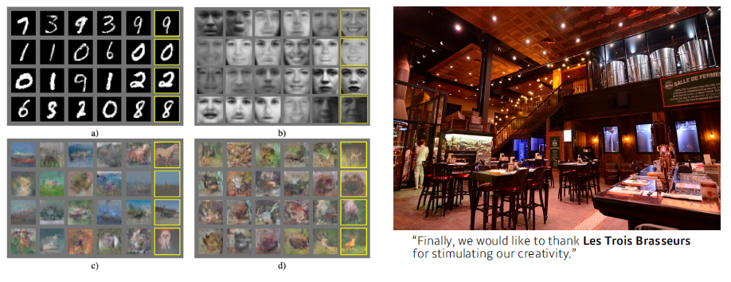

 

## 2.6. Residual Networks

- 딥러닝을 기계학습에 필요한 한 분야라고 했지만, 왜 딥러닝인지를 잘 알려주는 모델

	- 네트워크를 깊게 쌓을 수록 Test set에서 성능이 나오지 않았다. 

- residual block은 딥러닝 역사에서 모델을 깊게 쌓게 해주는 architecture 아이디어이다. 

	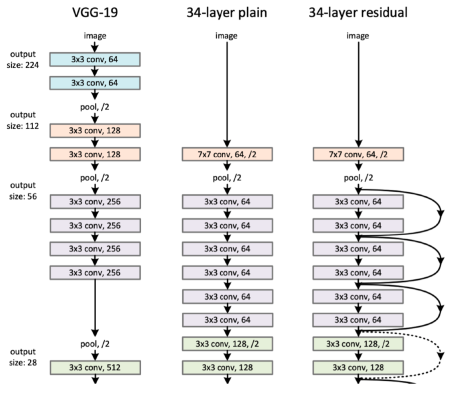

 

## 2.7 Transformer

- 제목부터 파격적

- attention이라는 구조가 다른 방법론들을 대체할 수 있는 좋은 아이디어를 제시했다. 

	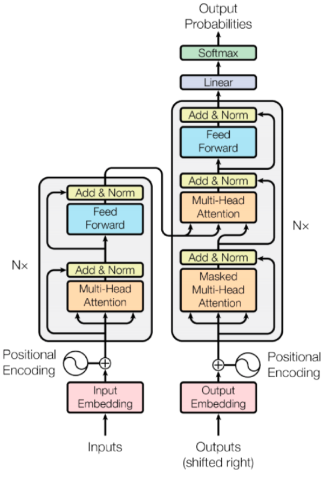

	

 

## 2.8 BERT

- Fine tuned NLP model로써 학습된 모델을 통한 재학습의 문을 열었다. 

- 일반적이고 범용적인 단어나 말뭉치를 학습하고, fine tuning함으로써 원하는 task에 맞는 모델로 구현되게 해주는 아이디어였다. 

	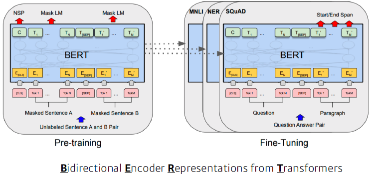

 

## 2.9. BIG language model

- GPT-3의 등장
- 175억개의 파라미터로 되어있는 모델

 

## 2.10. Self supervised learning

- SimCLR :  a simple framework for contrastive learning of visual representations

- 라벨은 모르지만 사용가능한 이미지들을 학습에 사용하고 싶었고 이를 컴퓨터가 이해할 수 있는 벡터로 표현하는 아이디어를 제시함

	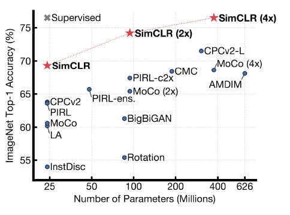

	 

