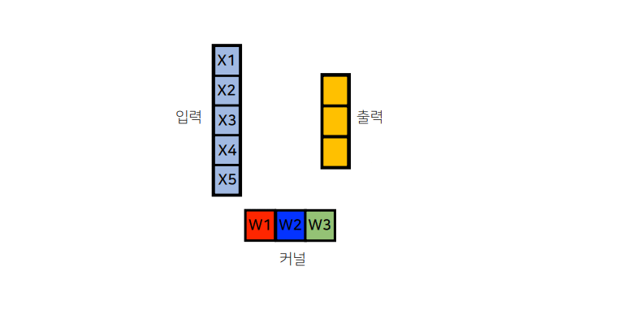

# [AI Math 9강] CNN 첫걸음

**Convolution 연산**과 **다양한 차원에서의 연산방법**을 소개합니다.

**Convolution 연산의 역전파**에 대해 설명합니다.

Convolution 연산은 오늘날 굉장히 많은 모델에서 이미지나 영상을 처리하기 위해 사용됩니다. 지금까지 배웠던 fully connected layer와 비교해서 CNN(Convolutional Neural Network)의 커널 연산이 가지는 장점과, Convolution 연산이 다양한 차원에서 어떻게 진행되는지를 이해하시고 넘어가시기 바랍니다.

Convolution 연산의 경우, 커널의 모든 입력데이터에 대해 공통으로 적용이 되기 때문에 역전파를 계산하는 경우에도 똑같이 Convolution 연산이 나오게 됩니다. 강의에서 그림과 함께 잘 설명되어 있기 때문에 커널을 통해 그레디언트가 어떻게 전달이 되는지, 역전파가 어떻게 이루어지는지 꼭 짚고 넘어가셨으면 좋겠습니다.

 

# 1. Convolution 연산 이해하기

지금까지 배운 MLP는 각 뉴런들이 선형모델과 활성함수로 모두 연결된 (Fully connected) 구조였다. 
$$
h_i = \sigma\left(\sum^p_{j=1}W_{ij}x_j\right)
$$

- 각 성분 $h_i$에 대응하는 가중치 행$W_i$이 필요하고, 
- 만일 $i$가 바뀌면 사용되는 가중치도 바뀌었다. 

Convolution 연산은 이와 달리 커널을 입력벡터 상에서 움직여가면서 선형모델과 합성함수가 적용되는 구조이다. 

- 모든 $i$에 대해 적용되는 커널은 $V$로 같고 커널의 사이즈만큼 $\mathbf{X}$상에서 이동하면서 적용한다.

Convolution 연산의 수학적인 의미는 신호(signal)를 **커널을 이용해 국소적으로 증폭 또는 감소**시켜서 정보를 추출 또는 필터링하는 것이다. 

> 수학적인 의미는 Continuous나 discrete나 별 차이없다. $z$라는 필터(커널)을 움직여가면서 convolution 연산을 수행하는 것을 의미한다. 
>
> 특히, CNN에서 사용하는 연산은 사실은 convolution이 아니고 `cross-correlation`으로써, 위 그림에서 `-`부호가 아닌 `+`부호를 사용하는 연산을 의미한다. 

커널은 정의역 내에서 움직여도 변하지 않고(**Translation invariant**) 주어진 신호에 **국소적**으로 적용한다. 

> 파란색 : 신호
>
> 빨간색 : 커널
>
> 검은색 : 컨볼루션 결과

 

# 2. 다차원에서의 Convolution

Convolution 연산은 1차원뿐만 아니라 다양한 차원에서 계산 가능하다. 

> 1차원 : $[f*g](i) = \sum^g_{p=1}f(p)g(i+p)$
>
> 2차원 :  $[f*g](i,j) = \sum_{p,q}f(p,q)g(i+p, j+q)$
>
> 3차원 :  $[f*g](i,j,k) = \sum_{p,q,r}f(p,q,r)g(i+p, j+q,k+r)$

$i,j,k$가 바뀌어도 커널 $f$의 값은 바뀌지 않는다는 점에 주의하자

 

## 2.1. 2-dimensional convolution

2D-Conv 연산은 1차원과 달리 커널을 입력벡터 상에서 움직여가면서 선형모델과 합성함수가 적용되는 구조이다. 
$$
[f*g](i,j) = \sum_{p,q}f(p,q)g(i+p, j+q)
$$

> 커널을 움직여가면서 convolution 연산을 진행한다.
>
> 주의할점은 행렬곱이 아닌 각 자리에 위치한 값들을 각각 곱하는 element-wise 연산을 한다. 
>
> $\Rightarrow 0\times 1+ 1\times 2 +2\times 4+ 3 \times5 =25$

입력 크기를 $(H,W)$, 커널 크기를 $(K_H, K_W)$, 출력 크기를 $(O_H, O_W)$라고 하면, 출력크기는 다음과 같이 계산한다. 
$$
O_H=H-K_H+1\\
O_W=H-K_W+1
$$

> 예를들어 $28\times 28$입력을 $3\times 3$커널로 연산하면, 출력 사이즈는 $26\times 26$이 된다.

 

## 2.2. 3-dimensional convolution

3차원 Convolution의 경우 2차원 Convolution을 3번 적용한다고 생각하면 된다. 
$$
[f*g](i,j,k) = \sum_{p,q,r}f(p,q,r)g(i+p, j+q,k+r)
$$

> tensor의 연산 방식은 2차원과 유사하므로 생략한다. 

# 3. Convolution 연산의 역전파

Convolution 연산은 커널이 모든 입력데이터에 공통으로 적용되기 때문에 역전파를 계산할 때 convolution 연산이 나오게 된다. 
$$
\begin{align}
\frac{\part}{\part x}[f*g](x)
&= \frac{\part}{\part x}\int_{\mathbb{R}^d}f(y)g(x-y)dy\\
&\\
&= \int_{\mathbb{R}^d}f(y)\frac{\part g}{\part x}(x-y)dy\\
&\\
&=[f*g'](x)

\end{align}
$$

>  역전파의 경우 아래와 같은 순서로 진행되므로 참고하기 바란다. 
>
> 

