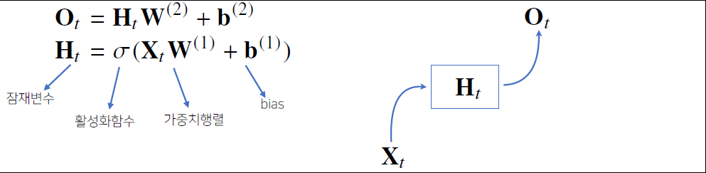

# [AI Math 10강] RNN 첫걸음

**강의 소개**

 

**시퀀스 데이터**의 개념과 특징, 그리고 이를 처리하기 위한 **RNN**을 소개합니다.

RNN에서의 역전파방법인 **BPTT**와 **기울기 소실**문제에 대해 설명합니다.

 

시퀀스 데이터만이 가지는 특징과 종류, 다루는 방법, 그리고 이를 위한 RNN(Recurrent Neural Network)의 구조를 앞선 강의에서 배웠던 CNN이나 다른 MLP(Multi Layer Perceptron)와 비교하면서 공부하시면 좋겠습니다.

RNN에서의 역전파 방법인 BPTT(Back Propagation Through Time)를 수식적으로 이해하고, 여기서 기울기 소실문제가 왜 발생할 수 있는지, 이에 대한 해결책은 어떤 것들이 있는지를 집중해서 보시기 바랍니다.

# Sequence Data overview

- 소리, 문자열, 주가 등의 데이터를 시퀀스 데이터로 분류합니다. 
- 시점별로 사건이 발생하므로 순서가 매우 중요하다.
	- 순서를 바꿨을 때 데이터의 분포가 변화하는 경우 예측분포가 매우 달라진다.
	- NOT **IID(independent identically distributed)**

 

## How to control Sequence DATA?

- 이전 시퀀스 정보를 가지고 앞으로 발생할 데이터의 확률분포를 다루기 위해 조건부확률을 이용할 수 있다.   
- 베이즈 법칙을 사용한다

$$
\begin{align}
&P(X_1, \dots, X_t) = \prod^t_{s=1}P(X_s\vert X_{s-1}, \dots, X_1)\\
&\Rightarrow X_t \sim P(X_t\vert X_{t-1}, \dots, X_1)
\end{align}
$$

- 위 조건부확률은 과거의 `모든 정보를 사용`하지만 시퀀스 데이터를 분석할 때 `모든 과거 정보들이 필요`한 것은 아니다. 
- 시퀀스 데이터를 다루기 위해서는 길이가 **`가변적인`** 데이터를 다룰 수 있는 모델이 필요하다.

$$
\begin{align}
X_t &\sim P(X_t\vert X_{t-1}, \dots, X_1)\\
X_{t+1} &\sim P(X_{t+1}\vert X_{t},X_{t-1}, \dots, X_1)
\tag{1}
\end{align}
$$

**자기회귀모델**

- 이때, 고정된 길이 $\tau$만큼의 시퀀스만 사용하는 경우 AR$(\tau)$(Autoregressive Model : 자기회귀모델)이라고 부른다. 

{:.center}

**잠재AR모델**

- 고정된 크기의 vector를 사용했던 앞선 내용과 달리, 바로 이전 정보를 제외한 나머지 정보들을 $H_t$라는 잠재변수(latent vector)로 인코딩해서 활용하는 잠재AR모델이다.

- 이때, $H_t=Net_\theta(H_{t-1}, X_{t-1})$로 표현된다. 
- 하지만 이 모델의 문제점은 잠재변수로 어떻게 인코딩하는지에 대한 것이 선택의 문제이다. 
- 이를 해결하기 위해 나온 모델이 **Recurrent Neural Network**이다.

 

## RNN

가장 기본적인 RNN 모형은 MLP와 유사한 모양이다. 
RNN은 이전 순서의 잠재변수와 현재의 입력을 활용하여 모델링한다. 

{:.center}

RNN의 역전파는 잠재변수의 연결그래프에 따라 순차적으로 역으로 계산된다. 

- 이를 Backpropagation Through Time(BPTT)라고 하며 RNN의 역전파 방법이다. 

	 

### BPTT

BPTT를 통해 RNN의 가중치 행렬의 미분을 계산해보면 아래와 같이 최종적으로 미분의 곱으로 이루어진 항이 계산된다. 

그림에서 보이듯이 해당 항은 시퀀스 길이가 길어질 수록 미분값의 변화 폭이 매우 커지면서 학습이 불안정해진다.

 

### Gradient Vanishing

시퀀스 길이가 길어지는 경우 BPTT가 불안정해지므로 길이를 끊는 것이 필요하다. 이 방법을 `Truncated BPTT`라고 부른다. 

- 예를들어 $X_t$의 gradient를 구할 때, $O_{t+1}$부터 계산되는 gradient를 구하는 것이 아니라 특정 block에서 끊고 $O_{t}$에서 오는 gradient만으로 계산하는 방법이다.

{:.center}

- 하지만 이 방법도 완벽하진 않다. 이를 위해 기본 Vanilla RNN이 아닌, `GRU` 혹은 `LSTM` 구조를 사용한다. 

 