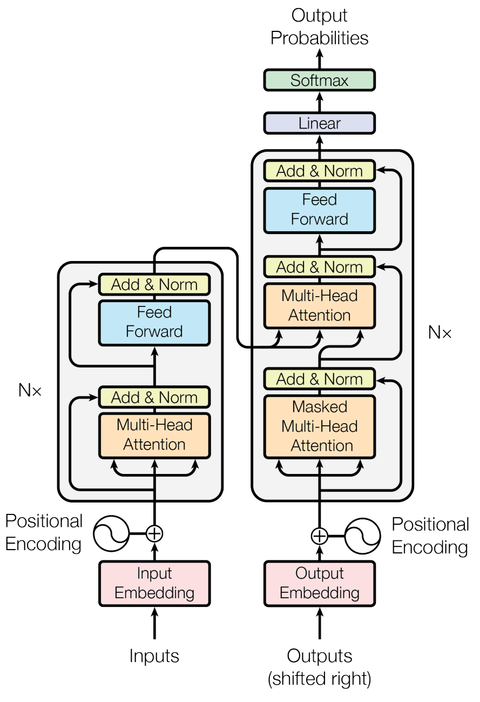

# [DLBasic] Sequential Models - Transformer

**강의 소개**

**[주의!] 해당 강의는 매우 어려울 수 있습니다.**

이번 강의는 이론, 실습, 과제로 구성됩니다.

이번 강의에서는 지난 강의에서 배운 **Sequential model의 한계점**과 이를 해결 하기 위해 등장한 **Transformer**에 대해 배웁니다. 
Transformer는 Encoder와 Decoder로 구성되어있지만 강의에서는 **Encoder와 Multi Head Attention 에 대해 좀 더 집중적으로** 배웁니다. 

\* 강의에서 Multi-head attention과 Multi-head**ed** attention 은 동일한 의미입니다!

 

**Further Reading**

- [Illustrated transformer (원글)](http://jalammar.github.io/illustrated-transformer/)
- [Illustrated transformer (번역)](https://nlpinkorean.github.io/illustrated-transformer/)
- [Pytorch official Transformer tutorial](https://pytorch.org/tutorials/beginner/transformer_tutorial.html)

**Further Questions**

- Pytorch에서 Transformer와 관련된 Class는 어떤 것들이 있을까요?

# Transformer

이번 강의에서는 지난 강의에서 배운 **Sequential model의 한계점**과 이를 해결 하기 위해 등장한 **Transformer**에 대해 배웁니다. 
Transformer는 Encoder와 Decoder로 구성되어있지만 강의에서는 **Encoder와 Multi Head Attention 에 대해 좀 더 집중적으로** 배웁니다. 

## Limitation of Sequential Model

What makes sequential modeling a hard problem to handle?

 

## Transformer

>  [**Attention is all you need, NIPS, 2017**](https://arxiv.org/pdf/1706.03762.pdf)에서 처음 소개되었다.

{:width="50%"}

- Transformer is the first sequence transduction model based entirely on attention.

Transformer는 encoding하는 방법론적인 내용이기 때문에 NMT(Neural Machine Translation) 분야에 국한되지 않는다. 

트랜스포머에서의 핵심은 3가지이다.

1. N개의 단어가 어떻게 한번에 encoder에서 처리되는지
2. encoder와 decoder가 어떠한 정보를 주고 받는지
3. decoder가 어떻게 generation 하는지

Transformer에 대한 내용은 블로그 따로 [**포스팅**](https://ydy8989.github.io/2021-01-10-transformer/) 했으므로 참고하길 바란다.

 

## Vision Transformer

단어를 기반으로 한 NLP Task에만 Transformer 구조를 사용하는 것 뿐만아니라 이미지 도메인에도 사용하기 시작했다. 

처음 [An Image is Worth 16x16 Words: Transformers for Image Recognition at Scale](https://arxiv.org/abs/2010.11929)라는 논문에서 발표된 모델이며 2020년 하반기에 발표된 따끈한 논문이다.

해당 architecture는 이미지 Classification task에 사용되었다. 

**Key Ideas**는 다음과 같다. 

- 이미지를 패치로 자르고, 해당 순서를 기억하게 하기 위한 Positional encoding과 같은 구조를 사용한다.
- 이를 sequential한 data와 비슷하게 사용하여 classification을 수행한다. 

 

## DALL-E

문장을 작성하면 그에 맞는 이미지를 생성해주는 모델이다.   
OpenAI에서 개발했으며, Transformer의 decoder만을 사용했다고 한다.   

