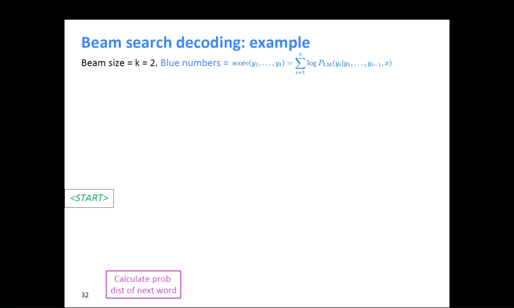

# (6강) Beam Search and BLEU

**강의 소개**

문장을 decoding 하는 데에 사용하는 대표적인 알고리즘인 **Beam Search**와 번역 task에서 번역된 문장을 평가하는 대표적인 metric인 **BLEU score**를 소개합니다.

언어 모델이 문장을 generation할 때에는 확률값에 기반한 다양한 경우의 수가 존재합니다. 모든 경우의 수를 고려하는 것은 비효율적이며 너무 작은 확률값까지 고려한다면 생성된 문장의 quality가 떨어질 수 있습니다. 가장 높은 확률값을 고려하는 방법 역시 모델이 단순한 generation을 하도록 하게 만드는 단점이 있을 수 있습니다. 이러한 문제의 대안으로 제안된 Beam Search를 알아봅니다.

자연어는 컴퓨터가 이해할 수 있는 방식으로 변환되어 모델의 입력 및 출력으로 활용되기 때문에 적절한 metric을 이용해 모델을 평가해야 합니다. 다양한 자연어처리 관련 metric이 있지만, 그중에서도 번역 task에서 가장 대표적인 BLEU score를 소개합니다. 번역에 있어서 BLEU score가 precision을 고려하는 이유에 대해서 고민하면서 강의를 들어주시면 좋을 것 같습니다.

**Further Reading**

- [Deep learning.ai-BeamSearch](https://www.youtube.com/watch?v=RLWuzLLSIgw&feature=youtu.be)
- [Deep learning.ai-RefiningBeamSearch](https://www.youtube.com/watch?v=gb__z7LlN_4&feature=youtu.be)
- [OpenNMT-beam search](https://opennmt.net/OpenNMT/translation/beam_search/)

**Further Question**

- BLEU score가 번역 문장 평가에 있어서 갖는 단점은 무엇이 있을까요?
	- 참고: [Tangled up in BLEU: Reevaluating the Evaluation of Automatic Machine Translation Evaluation Metrics](https://arxiv.org/abs/2006.06264?utm_source=feedburner&utm_medium=feed&utm_campaign=Feed%3A+arxiv%2FQSXk+%28ExcitingAds%21+cs+updates+on+arXiv.org%29)

---

## Beam search

자연어 생성모델에서 테스트 타임시 더 좋은 결과를 내기 위한 방법인 `beam search`를 알아보자. 

### Greedy approach

텍스트 생성시 모델은 가장 높은 확률로 등장할 단어를 출력하게 된다. 이 방법은 전체적인 구조에서의 확률값을 보는 것이 아니라 근시안적으로 현재 timestep에서 가장 좋아보이는 단어를 선택하는 형태를 `Greedy approach`라고 한다.

- Greedy decoding has no way to undo decisions!
	- input : il a m’entarté (he hit me with a pie)
		- he \___
		- he hit \___
		- he hit `a` \___ ~~(whoops, no going back now…)~~

위 예시에서 `hit` 다음 `me`가 나와야할 차례에 `a`가 나왔다고 했을 때, 이어 나오는 모든 예측은 틀어지게 된다. 그 이유는 뒤에서 사용해야할 단어를 이미 앞에서 생성해버렸기 때문이다. 이미 뒤늦게 깨달았다고 하더라도 이미 고정된 예측값은 바꿀 수 없다. 

### Exhaustive search

***Then how can we fix this?***

- Ideally, we want to find a (length $T$) translation $y$ that maximizes. 
	$$
	\begin{align}
	P(y\vert x)
	&=P(y_1\vert x)P(y_2\vert y_1, x)P(y_3\vert y_2, y_1, x)\dots P(y_T\vert y_1, \dots , y_{T-1}, x)\\
	&= \prod_1^TP(y_t\vert y_1, \dots , y_{t-1}, x)
	\end{align}
	$$

- We could try computing **all possible sequences** $y$

	- This means that on each step $t$ of the decoder, we are tracking $V^t$ possible partial translations, where $V$ is the vocabulary size
	- This $O(V^t)$ complexity is far too expensive!

즉, joint probability에서 순차적으로 각각의 최대를 곱한 값이 전체의 최대는 아닐 수도 있다는 것이며 앞에서 약간의 손해(작은 확률값)를 보더라도 뒤에서 만회할 수 있는 확률값을 선택하는 것이 이 아이디어의 핵심이다. 

하지만, 매 timestep마다 모든 가짓수를 고려한다면 너무 많은 계산량이 필요하다. 

### Beam search

디코더의 매 타임마다 적절한 $k$개의 가짓수를 고려하고, 그 중에서 가장 확률이 높은 것을 택하는 방법이다. 

> Core idea: on each time step of the decoder, we keep track of the $k$ most probable partial translations (which we call hypothese)
>
> - $k$ is the beam size (in practice around 5 to 10)
>
> A hypothesis $y_1, \dots, y_t$ has a score of its log probability:
> $$
> score(y_1, \dots, y_t) = logP_{LM}(y_1, \dots, y_t\vert x)=\sum^t_{i=1}logP_{LM}(y_i\vert y_1, \dots, y_{t-1},x)
> $$
> Scores are all negative, and a higher score is better  
> We search for high-scoring hypotheses, tracking the top k ones on each step  

log를 씌움으로써 곱셈을 덧셈연산으로 바꾸고, 추척하기 쉽도록 하는 것이 목표

- Beam search is not guaranteed to find a globally optimal solution.
- But it is much more efficient than exhaustive search!

모든 경우를 다 보는 것은 아니지만, 후보군을 추리기 쉽다.!!!

**example)**

{:width="80%"}{:.center}

> 출처 : [https://web.stanford.edu/class/cs224n/slides/cs224n-2019-lecture08-nmt.pdf](https://web.stanford.edu/class/cs224n/slides/cs224n-2019-lecture08-nmt.pdf)

위와 같이 k=2일 때, 계속적으로 확률이 높은 후보군을 찾으면서 결과를 예측한다. 

### Beam search: Stopping criterion

- Usually we continue beam search until:
  - We reach timestep 𝑇 (where 𝑇 is some pre-defined cutoff), or 
  - We have at least 𝑛 completed hypotheses (where 𝑛 is the pre-defined cutoff)

### Beam search: Finishing up

- We have our list of completed hypotheses
- How to select the top one with the highest score?
- Each hypothesis $𝑦_1, … , 𝑦_t$ on our list has a score

$$
score(y_1, \dots, y_t) = logP_{LM}(y_1, \dots, y_t\vert x)=\sum^t_{i=1}logP_{LM}(y_i\vert y_1, \dots, y_{t-1},x)
$$

- Problem with this : **longer hypotheses have lower scores**
- Fix : Normalize by length

$$
score(y_1, \dots, y_t) = \frac{1}{t}\sum^t_{i=1}logP_{LM}(y_i\vert y_1, \dots, y_{t-1},x)
$$

## BLEU score

자연어 생성 모델에서 생성 모델의 품질 및 결과를 평가하는 scoring 방식을 알아보자

